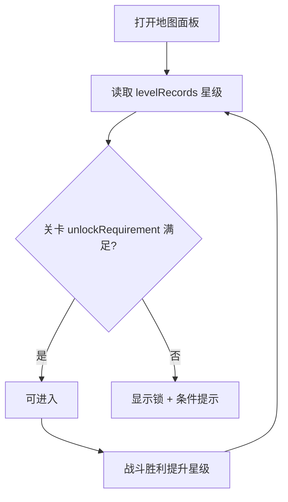

# 关卡进度解锁

> 归属系统：成长与进度 ｜ 优先级：P1 ｜ 状态：规划中
> 关卡按顺序 gating，以星级为解锁条件，并提供更多关卡内容。

## 现状与差距

- 现状：3 个关卡全部可直接进入，无顺序限制；关卡数量少。
- 目标：前一关达到指定星级解锁下一关；扩充关卡内容（新布阵、新防御组合）。

## 设计方案（使用方法）

### 解锁规则

- 关卡表增加 `unlockRequirement: { levelId, stars }`（如"第 2 关需第 1 关 ≥1 星"）。
- 第 1 关默认解锁；地图面板未解锁关显示锁 + 条件文案，点击提示。
- 解锁状态实时推导（读 `levelRecords` 星级），不落额外存档字段，避免状态不同步。

### 内容扩充

- 关卡资产 `asset/*.scene.json` 增补：不同防御塔组合/城墙布局/资源库布局，难度递进。
- 地图面板支持分组（章节）展示，为后续扩展留结构。

### 涉及文件（预估）

- `asset/`：关卡 scene 资产扩充
- `gameplay/base/MapPanel.script.ts`：锁定渲染、条件判断
- 战斗入口：进入前校验解锁状态（防止 GM/直连绕过时给出提示）

## 工作流程

## 边界条件

- GM 控制台可强制解锁（调试用），正式流程不受影响。
- 需求关卡被删/改 id：视为满足条件并记 warn 日志，避免卡死。
- 星级评价为零（未接入 [星级战绩评价](star-rating.md)）时本模块不可独立上线。

## 验收标准

- 未达星关卡无法进入且提示明确；达标后无需重启即可进入；全部关卡资产零 lint 错误。

## 关联

- 依赖：[星级战绩评价](star-rating.md)。
- 联动：新手引导（[教程](../meta/tutorial.md)）指向第 1 关。
