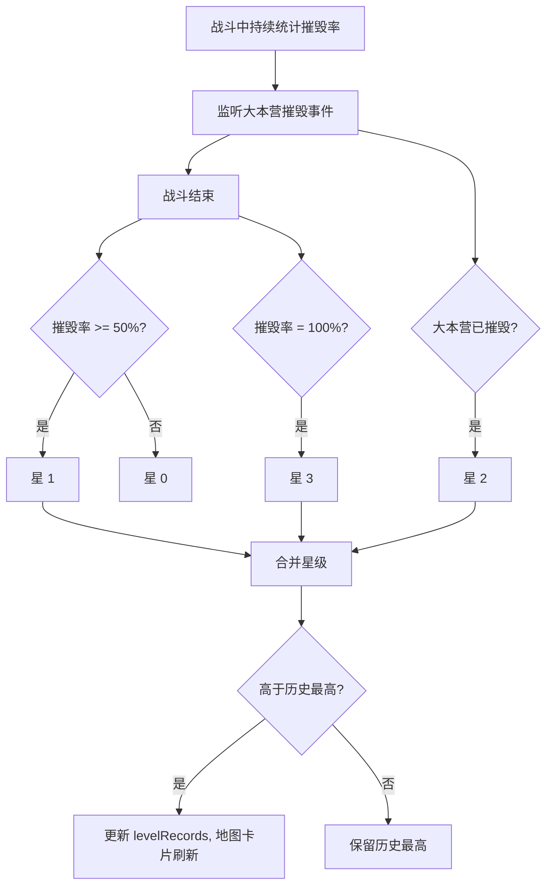

# 星级战绩评价

> 归属系统：成长与进度 ｜ 优先级：P1 ｜ 状态：规划中
> 用三星规则量化战斗表现，是关卡解锁的前置条件。

## 现状与差距

- 现状：关卡表 `stars` 字段仅为难度占位（`gameplay/base/MapPanel.script.ts` 仅用于卡片标题）；战斗结算只有胜负，无战绩评级与历史记录。
- 目标：按摧毁进度评 1-3 星，按关卡持久化历史最高星级。

## 设计方案（使用方法）

### 星级规则

- ⭐1：摧毁率 ≥ 50%
- ⭐2：摧毁大本营
- ⭐3：摧毁率 100%（全灭建筑）
- 三者独立达成、按或合并；星星逐个点亮动画。

### 结算与存档

- 结算面板显示本局星级 + 各条件达成情况；写入存档 `levelRecords: { [levelId]: { bestStars, bestDestroyRate } }`。
- 地图面板关卡卡片显示历史最高星（未打过显示 0 星灰色）。
- 刷新规则：只有更高星级才覆盖 `bestStars`。

### 涉及文件（预估）

- `gameplay/battle/`：结算管线增加星级计算（大本营摧毁事件需从建筑组件获取）
- `gameplay/base/MapPanel.script.ts`：卡片星级渲染
- 存档 schema：`levelRecords`

## 工作流程

## 边界条件

- 星级以战斗结束时点为准；超时结算（[战斗时限](../battle/battle-timer.md)）同样计入。
- 大本营在结算瞬间才被摧毁：以结算管线的判定顺序为准（先统计后判星）。
- 存档无 `levelRecords` 视为 0 星，不做迁移。

## 验收标准

- 三种星级条件可独立触发验证；重复打关只保留最高星；地图卡片显示正确。

## 关联

- 被依赖：[关卡进度解锁](level-unlock.md) 以本模块星级为解锁条件。
- 联动：三星可设为 [宝石货币](../economy/gem.md) 的产出渠道（每关首杀三星奖励）。
