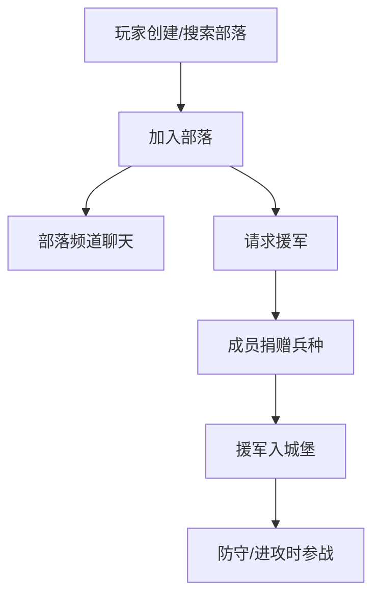

# 部落与援军

> 归属系统：社交 ｜ 优先级：P3 ｜ 状态：规划中（依赖后端）
> 部落、好友、聊天与援军捐赠，需要服务端支持，单机版最后启动。

## 现状与差距

- 现状：纯单机，无任何社交能力。
- 目标：部落创建/加入、成员列表、聊天、援军捐赠（成员捐兵驻防己方基地）。

## 设计方案（使用方法）

- 服务端：需要账号体系与部落服务的后端（或先用 DSH agent 局域网模拟）；客户端通过 IPC/MCP 桥接。
- 援军：成员捐赠兵种存入对方城堡，防守战与进攻战可使用；容量由城堡等级决定。
- 聊天：部落频道文本消息，敏感词过滤，消息走服务端广播。

## 工作流程

## 边界条件

- 断网降级：社交功能不可用时单机流程完全不受影响。
- 捐赠限额（每请求/每日）防刷；捐赠兵种等级按捐赠者研究等级。

## 验收标准

- 双端联调：捐赠-接收-参战闭环；断网时游戏可正常单机进行。

## 关联

- 前置：无硬前置，但建议在 P0-P2 稳定后启动。
- 被依赖：[联机 PvP](pvp.md) 共用账号与后端。
