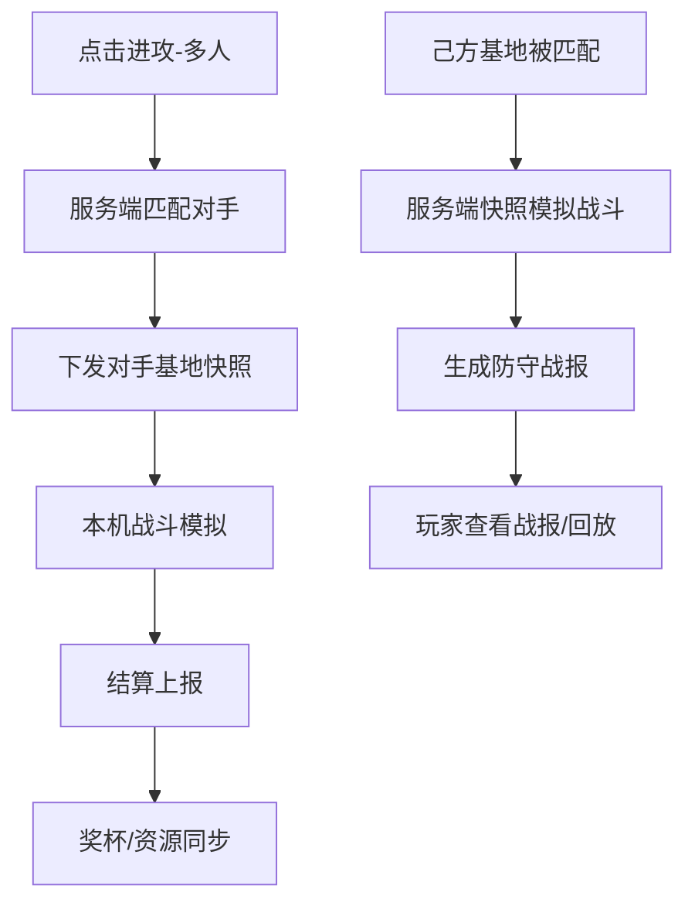

# 联机 PvP 与防守战报

> 归属系统：社交 ｜ 优先级：P3 ｜ 状态：规划中（依赖后端）
> 进攻其他玩家基地快照、自己基地被攻打、战斗回放。

## 现状与差距

- 现状：只攻打预置关卡（PvE）；自己的基地永远不会被攻打，无战报。
- 目标：匹配对手攻打其基地快照；自己基地被离线攻打时生成防守战报与回放。

## 设计方案（使用方法）

- 对手匹配：按大本营等级/奖杯分匹配；对手基地以快照（布局 + 等级）形式下发，战斗仍在本机模拟。
- 防守战报：被攻打时服务端用己方基地快照模拟战斗（或记录攻方输入做确定性回放），生成战报（进攻者/损失/防守结果）。
- 回放：战斗指令流（放兵时序 + 法术落点）确定性重放，依赖战斗逻辑确定性（随机数需种子化）。

## 工作流程

## 边界条件

- 回放确定性：战斗随机数种子化，指令流版本化，版本不符标记"无法回放"。
- 离线保护：离线盾/低本保护期等防骚扰规则入配置。
- 快照校验：布局合法性校验（网格、重叠），防伪造。

## 验收标准

- 攻防双向闭环：打人得资源/奖杯，被打收战报；回放与实际战斗结果一致。

## 关联

- 前置：[部落与援军](clan.md) 的账号与后端基础设施。
- 依赖本模块：[英雄系统](../battle/hero.md) 的驻守防守能力。
