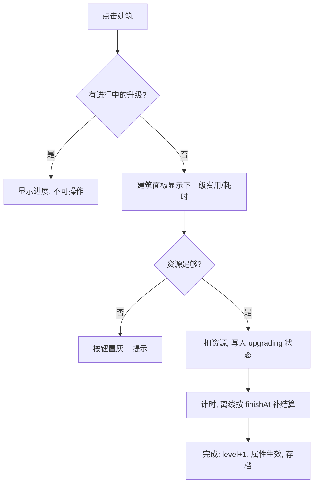

# 建筑升级

> 归属系统：基地经营 ｜ 优先级：P0 ｜ 状态：规划中
> 让每种建筑拥有多等级属性与升级流程，是经营闭环的核心（资源的主要消耗出口）。

## 现状与差距

- 现状：建筑为固定单级属性（`asset/config/` 下建筑配置表，经 ConfigRegistry 加载）；只能建造/移动/删除，属性永不变化。
- 目标：建筑可消耗资源 + 时间升级；等级提升属性（生命值、产出速率、容量）；大本营等级 gate 其他建筑上限。

## 设计方案（使用方法）

### 数据与配置

- 建筑配置表升级为按等级数组：每级 `upgradeCost`（金币/药水）、`upgradeTime`、`hp`、`produceRate`、`storage` 等；第 1 级即当前数值，保证旧配置平移。
- 建筑实例（存档）增加 `level` 字段，旧存档缺省按 1 处理。
- 大本营等级 gate 表：`buildingType -> maxAllowedLevel`，大本营升级解锁其他建筑上限。

### 交互

- 点击己方建筑弹出建筑面板：当前等级/属性、下一级属性预览、升级费用与耗时。
- 升级中建筑进入 `upgrading` 状态：脚手架外观 + 剩余时间进度条；期间不可再次升级。
- 升级完成即时生效：`level + 1` 写回存档，属性刷新。
- 取消升级：返还 50% 资源（规则开关可配）。

### 涉及文件（预估）

- `gameplay/base/`：建筑状态机扩展（`upgrading`）、建筑面板 UI 脚本、计时服务（UpgradeTimer）
- `asset/config/`：建筑配置表按等级扩展；assetLint 同步校验等级字段
- 存档 schema：`level`、`upgrading: { targetLevel, finishAt }`

## 工作流程

## 边界条件

- 资源不足：按钮置灰，不产生任何扣费。
- 升级中的大本营：其他建筑上限按升级前等级计算，完成后刷新。
- 离线完成：基于 `finishAt` 时间戳结算，重进基地时补结算并写日志。
- 旧存档兼容：无 `level` 默认 1；`upgrading` 残留数据按时间戳直接判完成。
- 移动/删除：升级中允许移动、不允许删除（删除需先取消，返还规则同取消）。

## 验收标准

- 升级前后属性变化可在面板与战斗中验证（防御塔/大本营血量）。
- 断电重进后升级进度正确（离线结算），存档零 lint 错误。
- 关键节点日志齐全：进入升级、扣费、完成、离线补结算。

## 关联

- 资源来源：[资源产出与收集](resource-collection.md)。
- 加速/秒完成由 [宝石货币](../economy/gem.md) 统一提供（预留 FastForward 入口）。
