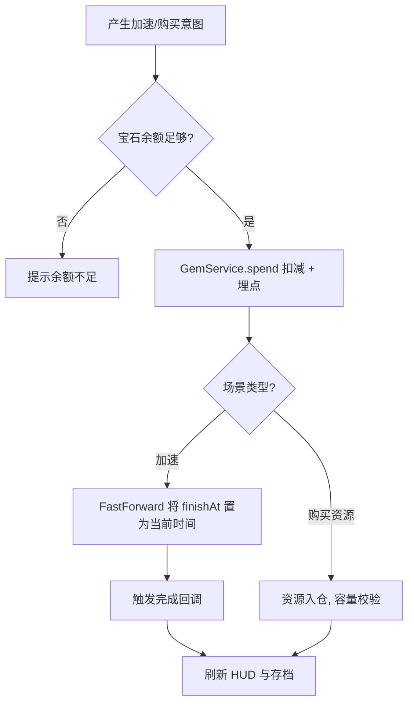

# 宝石货币

> 归属系统：经济 ｜ 优先级：P2 ｜ 状态：规划中
> 第三货币：加速/秒完成建造与研究、购买资源，是经营系统的润滑剂。

## 现状与差距

- 现状：无宝石货币（`textures.ts` 的 `gem` 只是颜色变量），无加速/秒完成、购买资源的消耗场景。
- 目标：引入宝石获取渠道与统一消耗入口，接入建造/研究/训练的加速体系。

## 设计方案（使用方法）

### 数据与存档

- 资源体系新增 `gem`：存档 `resources` 增加 `gem` 字段；HUD 资源栏追加宝石图标。
- 不设仓库容量上限（区别于金币/药水）。

### 获取渠道

- 成就奖励（[成就与每日任务](../meta/achievement.md)）
- 每关首杀三星奖励（[星级战绩评价](../progression/star-rating.md)）
- 障碍物清除概率掉落（[障碍物与装饰](../base/obstacle-decor.md)）
- GM 控制台发放（调试）

### 消耗场景

- 加速：建造升级（[建筑升级](../base/building-upgrade.md)）、研究（[兵种升级](../base/troop-upgrade.md)）剩余时间折算宝石立即完成。
- 补资源：直接购买金币/药水。
- 统一 API：`GemService.spend(reason, amount)` 与 `FastForward(finishAt)`，所有消耗走同一入口便于埋点与对账。

## 工作流程

## 边界条件

- 加速折算公式全局统一（如每分钟 1 宝石，向上取整），避免各处不一致。
- 扣费与效果必须同事务：先校验后扣减，失败不产生任何状态变化。
- 旧存档无 `gem` 字段默认 0。
- GM 发放/扣减必须走同一 `GemService`，保证日志可追溯。

## 验收标准

- 加速后计时立即完成且属性生效；余额与 HUD、存档三处一致；消耗日志完整。

## 关联

- 依赖方：[建筑升级](../base/building-upgrade.md)、[兵种升级](../base/troop-upgrade.md) 提供 `FastForward` 入口。
- 产出依赖：[成就与每日任务](../meta/achievement.md)、[星级战绩评价](../progression/star-rating.md)。
